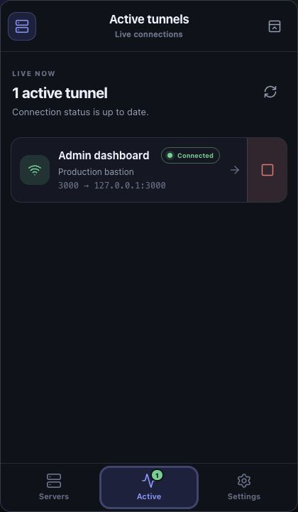
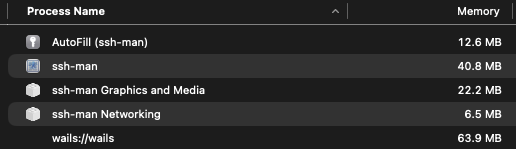
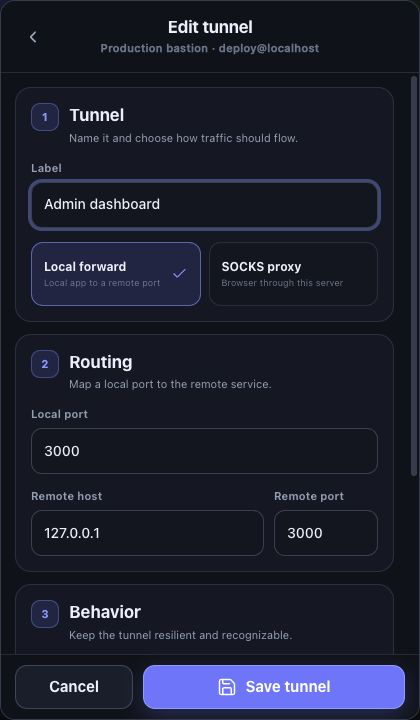
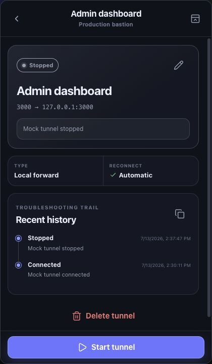
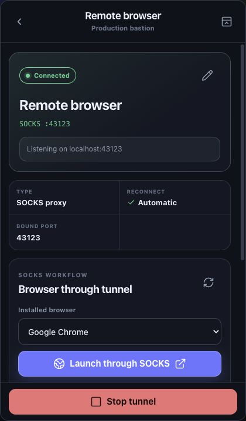

[](LICENSE.md)

# ssh-man

<table>
  <tr>
    <td width="120" valign="middle">
      <a href="https://moonpixels.tech">
        
      </a>
    </td>
    <td valign="middle">
      <strong>Gifted with love by <a href="https://moonpixels.tech">MoonPixels.tech</a>.</strong><br />
      MoonPixels builds custom apps for startups and small teams, helps non-technical founders launch MVPs quickly, and provides senior engineering help when you need to turn an idea into a real product.
    </td>
  </tr>
</table>

`ssh-man` is a desktop SSH tunnel manager for people who live on remote boxes.

Save your servers once, keep your port forwards and SOCKS5 proxies organized under each host, and launch a browser through the remote network path when you need to test something exactly the way that server sees it.

## Why use it

Remote development is great right up until your workflow turns into a pile of terminal tabs and one-off SSH commands.

`ssh-man` gives you a clean desktop UI for the setup you end up using every day:

- a saved `localhost:3000 -> remote:3000` tunnel for the app you are building
- another forward for a debugger, admin UI, or database port
- a saved SOCKS5 proxy so your browser can work against the remote server almost like it is local
- one-click browser launch through that SOCKS5 tunnel with a dedicated browser profile per server

That means you can develop on a remote machine while keeping a workflow that still feels local:

- open remote web apps on `localhost`
- hit internal-only services without retyping SSH commands
- test browser behavior through the remote box's network path
- keep separate browser state for each environment
- reconnect quickly after laptop sleep, network changes, or temporary SSH drops

## What makes `ssh-man` useful

- Save servers and multiple tunnel configurations under each one
- Run local forwards and SOCKS5 proxies from the same UI
- Launch supported browsers through a running SOCKS5 tunnel
- Open one persistent native file-explorer window per saved server
- Edit and safely save remote source in Monaco with optional Vim controls
- Favorite per-server folders, render Markdown, and safely render HTML with relative assets
- Download remote files or complete folders over SFTP
- Preview the exact browser command before launch
- Use the local SSH agent by default
- Support encrypted private keys when you need file-based auth
- Auto-reconnect interrupted tunnels and surface clear runtime state
- Optionally connect selected tunnels automatically when SSH Man starts
- Keep browser profiles, session history, and app data in the normal OS config directory
- Live in the macOS menu bar and open as a compact 420 x 720 control window
- Stay minimal: no terminal juggling, no shell-script graveyard, no memorizing flags

## Remote dev, but smoother

The core pitch is simple: make a remote server feel closer to local development without pretending the server is local.

Use local forwards when you want non-browser tools to connect to remote services on `localhost`, like:

- `localhost:5173` to a remote frontend dev server
- `localhost:8080` to a private admin app
- `localhost:5432` to a remote database or a database tunnel hop

That is the right fit for tools like DBeaver, debuggers, database clients, and anything else that just needs a direct local endpoint.

Use a SOCKS5 tunnel when you want the browser itself to develop against the remote server as if it were local, without changing your whole machine's proxy settings.

That is especially useful for:

- testing apps that only resolve or route correctly from inside the remote environment
- checking OAuth, SSO, and callback flows that depend on the remote network path
- reproducing production-like browser behavior without changing your whole system proxy
- using a dedicated browser profile for one environment so its cookies, sessions, and extensions do not bleed into another

`ssh-man` turns that into a repeatable workflow: start the SOCKS tunnel, pick a browser, click launch, and test.

## Lightweight by design

`ssh-man` is built with Go and Wails, which is a great fit for a utility app like this.

- the backend is native Go, so tunnel management, SSH handling, persistence, and session recovery are not running inside a heavy Electron stack
- Wails uses the native OS webview instead of bundling an entire browser runtime with the app
- that keeps startup fast, distribution smaller, and memory overhead low for a tool you may leave open all day

On your machine, that usually means `ssh-man` sits under roughly `150 MB` of RAM while still giving you a modern desktop UI.

## Screenshots

### Menu-bar active connections



### Memory usage



### Tunnel editor



### Tunnel status and history



### SOCKS browser launcher



## How it works

1. Add a server.
2. Save one or more tunnel configurations under it.
3. Start the tunnel you need.
4. For local forwards, use the bound `localhost` port from your normal tools.
5. For SOCKS5, launch a supported browser through the tunnel and browse from the remote server's network perspective.
6. To work with remote files, open a server and choose **Explore files**.

The app persists your saved structure, browser profiles, theme preference, and connection history so the next session starts where you left off.

## Supported workflows

### Local forwards

Save and reuse direct forwards such as:

- `localhost:3000 -> 127.0.0.1:3000`
- `localhost:9229 -> 127.0.0.1:9229`
- `localhost:5432 -> private-db.internal:5432`

### SOCKS5 proxy tunnels

Save SOCKS5 tunnels with either:

- a fixed local port you know and reuse
- an automatically assigned local port when you just want a clean open socket

### Browser launch through SOCKS5

When a SOCKS tunnel is connected, `ssh-man` can:

- detect installed browsers
- show whether each browser supports proxy launch
- preview the launch command
- launch the browser with SOCKS settings and an isolated per-server profile

Chromium-based browsers are launched with a SOCKS5 proxy flag and dedicated user-data directory. Firefox gets a generated profile configured for the proxy. Unsupported browsers are shown clearly instead of failing mysteriously.

### Remote file explorer

Each saved server can open its own resizable explorer window. It maintains a long-lived SFTP connection, remembers the last remote folder and favorite folders for that server, supports Finder-style multi-selection, and downloads files or recursively downloads folders into a local destination you choose.

Text and source files open in Monaco and can be saved back through SFTP. Enable the persisted **Vim controls** checkbox for Vim keybindings and `:w`; `Command+S`/`Ctrl+S` and the Save button work in either mode. Saves preserve remote permissions, use an atomic same-directory replacement, and stop rather than overwrite when the remote content changed after it was opened. Files larger than 2 MB remain preview/download-only.

Markdown has rendered and source views. HTML, SVG, PDF, images, audio, and video use the native browser renderer; relative HTML assets resolve against the remote file's directory. Active scripts are disabled in HTML previews so a remote document cannot call SSH Man's native bindings. Download the file and open it in a normal browser when script execution is required.

## Install

## macOS

Use Homebrew for the standard macOS install path.

### Homebrew install

```bash
brew tap ericwooley/homebrew-apps
brew install --cask ssh-man
xattr -d com.apple.quarantine /Applications/ssh-man.app
ssh-man version
```

Homebrew installs the menu-bar app and links its full CLI into your `PATH` as `ssh-man`. The app is currently distributed unsigned, so remove the quarantine attribute before first launch or CLI use. If Homebrew replaces the app bundle during a later upgrade, run the same `xattr -d com.apple.quarantine /Applications/ssh-man.app` command again before opening the updated copy.

### Upgrade

```bash
brew upgrade --cask ssh-man
xattr -d com.apple.quarantine /Applications/ssh-man.app
```

### macOS notes

- Launching `ssh-man` adds its terminal icon to the menu bar instead of opening a normal Dock window. Click the icon to show or hide the compact controls.
- Hiding the popup leaves tunnels running. Use **Settings → Quit SSH Man** or the icon's context menu when you want to stop sessions and exit cleanly.
- If Gatekeeper warns because the app is unsigned, open it from Finder with `Open` and confirm once.
- `ssh-man` uses your local SSH agent by default, so make sure your agent is running and `SSH_AUTH_SOCK` is available to GUI apps.
- App data is stored under `~/Library/Application Support/ssh-man`.
- Homebrew creates the automatic CLI link. A direct DMG copy keeps the CLI inside `ssh-man.app/Contents/MacOS/ssh-man` but does not modify your shell `PATH`.

## Command line

The CLI controls the same saved servers, tunnels, and live sessions as the menu-bar app. Commands accept an exact ID or exact name. When tunnel labels are duplicated, add `--server` to select the intended server.

```bash
# Inspect saved and live state
ssh-man status
ssh-man server list
ssh-man tunnel list
ssh-man tunnel history "Docs proxy" --server "Production" --limit 10

# Control tunnels
ssh-man tunnel start "Docs proxy" --server "Production"
ssh-man tunnel stop "Docs proxy" --server "Production"
ssh-man tunnel restart "Docs proxy" --server "Production"

# Control the menu-bar app and collect diagnostics
ssh-man app show
ssh-man app hide
ssh-man app status
ssh-man diagnostics
```

Use machine-readable output for scripts and automation:

```bash
ssh-man --output json status
ssh-man --output json tunnel list --server "Production"
```

Stable exit codes make tunnel state safe to branch on in scripts: `0` success, `1` operation or partial-bulk failure, `2` invalid CLI usage, `3` selector not found or ambiguous, `4` menu-bar agent unavailable, `5` tunnel failed, `6` key unlock or other user attention required, and `7` connect or request timeout. A read-only status command still exits `0` when it reports a failed tunnel.

Server and tunnel creation are also available without opening the UI:

```bash
ssh-man server add "Production" --host ssh.example.com --user deploy --auth agent
ssh-man tunnel add local "Docs proxy" --server "Production" --listen 3000 --remote 127.0.0.1:3000
ssh-man tunnel add socks "Browser proxy" --server "Production" --listen auto
```

Server and tunnel deletion require `--yes`; `app quit` requires it when tunnels are active. Key passphrases are accepted through a hidden terminal prompt or `--passphrase-stdin`; they are never accepted as command-line arguments where process listings or shell history could expose them. Run `ssh-man --help` for the complete command reference.

## Linux

Linux is currently supported through a clone-and-build workflow.

### Requirements

- Go `1.24.x`
- Node.js with Corepack (or pnpm)
- `pkg-config`
- GTK 3 development headers
- WebKitGTK 4.1 development headers

Ubuntu or Debian example:

```bash
sudo apt update
sudo apt install -y golang-go pkg-config libgtk-3-dev libwebkit2gtk-4.1-dev
npm install -g corepack
corepack enable
```

### Build and run

```bash
git clone git@github.com:ericwooley/ssh-man.git
cd ssh-man
./scripts/build-current-os.sh
./build/bin/ssh-man
```

The same binary provides the CLI. For example:

```bash
./build/bin/ssh-man --help
./build/bin/ssh-man status
```

If your distro needs the explicit Linux Wails build path, use:

```bash
./scripts/wails-build-linux.sh
./build/bin/ssh-man
```

### Linux notes

- This repo uses the `webkit2_41` Wails build tag for Linux builds.
- A plain `wails build -clean` may fail on systems that only expose the wrong WebKit package through `pkg-config`.
- App data is stored under `${XDG_CONFIG_HOME:-~/.config}/ssh-man`.

## Build from source

### Requirements

- Go `1.24.x`
- Node.js
- Corepack (or pnpm)
- Xcode Command Line Tools on macOS

Install the Xcode tools if needed:

```bash
xcode-select --install
```

Install Corepack if your Node.js distribution does not include it:

```bash
npm install -g corepack
corepack enable
```

### macOS build and run

```bash
git clone git@github.com:ericwooley/ssh-man.git
cd ssh-man
./scripts/build-current-os.sh
open build/bin/ssh-man.app
build/bin/ssh-man.app/Contents/MacOS/ssh-man --help
```

The packaged app bundle is written to `build/bin/ssh-man.app`; its executable serves both the desktop and CLI entrypoints. Homebrew links that executable automatically. Source builds can invoke the path above directly or create their own `ssh-man` symlink in a directory already on `PATH`.

## Development

### Run in dev mode

```bash
./scripts/dev-current-os.sh
```

### Validate the repo

```bash
./scripts/validate.sh
```

### Release credential

The privileged release job reads `TAP_GITHUB_TOKEN` from the protected `release` GitHub environment. Do not create this as a repository-wide secret. For the current workflow, use a fine-grained personal access token with:

- resource owner `ericwooley`
- access to only `ericwooley/homebrew-apps`
- repository permission **Contents: Read and write**; no other write permissions
- the shortest practical expiration, such as 90 days or less

In the `ssh-man` repository, create an environment named `release`, require a reviewer, restrict it to version-tag deployments, and add the token under **Environment secrets** with the exact name `TAP_GITHUB_TOKEN`. A tagged release can build and validate without this credential; the tap-publishing job pauses for approval, and GitHub does not provide the environment secret until that approval is granted. Approve only a release tag and commit you recognize.

Rotate the credential before it expires: create a replacement token, update the environment secret, verify a release, and then revoke the old token. Prefer a GitHub App installed only on `homebrew-apps` with **Contents: Read and write** if the workflow is updated to mint a short-lived installation token at runtime; do not store an installation token as a long-lived secret.

### Frontend-only checks

```bash
./scripts/pnpm.sh install
./scripts/pnpm.sh run validate
```

## First-run tips

- New servers default to `localhost`, your current OS username, and `SSH agent` auth.
- If you want file-based auth instead, switch the server to `Private key` and choose a detected key from `~/.ssh` or enter a custom path.
- Browser profiles are persisted per server under the app config directory so bookmarks, extensions, and other browser state survive restarts.
- SOCKS browser launch only works for a running SOCKS tunnel, so start the tunnel first.

## Project layout

```text
frontend/   React UI
internal/   Go application code
scripts/    build, dev, and validation helpers
tests/      integration and smoke coverage
```

## Status

- macOS: supported via Homebrew cask and local source build
- Linux: supported via local source build
- Homebrew tap: `ericwooley/homebrew-apps`

## License

`ssh-man` is available under Apache License 2.0 with the Commons Clause license condition.

That means the source is available and the core Apache 2.0 terms still apply, but the Commons Clause adds a restriction on selling the software or services whose value substantially comes from the software itself.

See `LICENSE.md` for the full license text.
