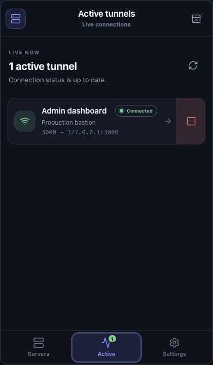
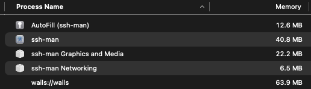
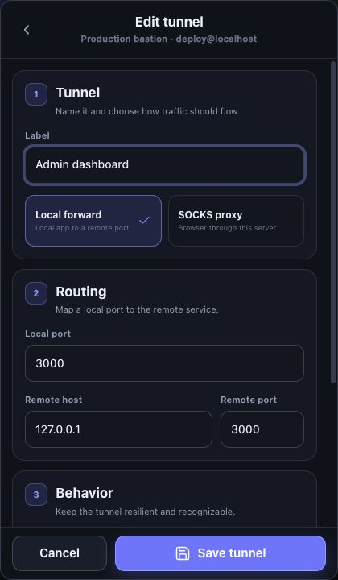
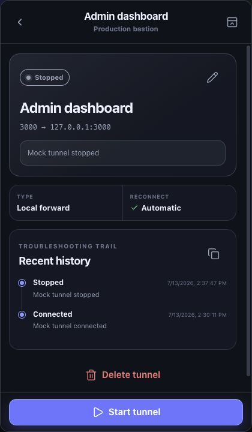
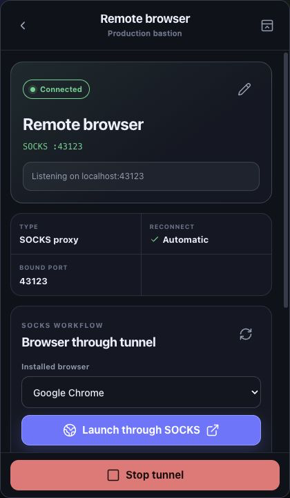

[](LICENSE.md)

# ssh-man

<table>
  <tr>
    <td width="120" valign="middle">
      <a href="https://moonpixels.tech">
        
      </a>
    </td>
    <td valign="middle">
      <strong>Gifted with love by <a href="https://moonpixels.tech">MoonPixels.tech</a>.</strong><br />
      MoonPixels builds custom apps for startups and small teams, helps non-technical founders launch MVPs quickly, and provides senior engineering help when you need to turn an idea into a real product.
    </td>
  </tr>
</table>

`ssh-man` is a desktop SSH tunnel manager for people who live on remote boxes.

Save your servers once, keep your port forwards and SOCKS5 proxies organized under each host, and launch a browser through the remote network path when you need to test something exactly the way that server sees it.

## Why use it

Remote development is great right up until your workflow turns into a pile of terminal tabs and one-off SSH commands.

`ssh-man` gives you a clean desktop UI for the setup you end up using every day:

- a saved `localhost:3000 -> remote:3000` tunnel for the app you are building
- another forward for a debugger, admin UI, or database port
- a saved SOCKS5 proxy so your browser can work against the remote server almost like it is local
- one-click browser launch through that SOCKS5 tunnel with a dedicated browser profile per server

That means you can develop on a remote machine while keeping a workflow that still feels local:

- open remote web apps on `localhost`
- hit internal-only services without retyping SSH commands
- test browser behavior through the remote box's network path
- keep separate browser state for each environment
- reconnect quickly after laptop sleep, network changes, or temporary SSH drops

## What makes `ssh-man` useful

- Save servers and multiple tunnel configurations under each one
- Run local forwards and SOCKS5 proxies from the same UI
- Launch common or user-defined browsers through a running SOCKS5 tunnel
- Open one persistent native file-explorer window per saved server
- Edit and safely save remote source in Monaco with optional Vim controls
- Favorite per-server folders, render Markdown, and safely render HTML with relative assets
- Upload local files by dropping them into the open remote folder
- Download remote files or complete folders over SFTP
- Switch directly between proxy-launched and regular browser instances with a configurable global shortcut on macOS
- Set SSH Man as the macOS default browser and route links with ordered literal or regular-expression rules
- Pauseable timed link chooser with regular-browser and browser-through-host destinations
- Probe every explicit URL port through connected SSH hosts and save a default browser/host assignment per port
- Preview the exact browser command before launch
- Use the local SSH agent by default
- Support encrypted private keys when you need file-based auth
- Auto-reconnect interrupted tunnels and surface clear runtime state
- Optionally connect selected tunnels automatically when SSH Man starts
- Keep browser profiles, session history, and app data in the normal OS config directory
- Live in the macOS menu bar and open as a compact 420 x 720 control window
- Stay minimal: no terminal juggling, no shell-script graveyard, no memorizing flags

## Remote dev, but smoother

The core pitch is simple: make a remote server feel closer to local development without pretending the server is local.

Use local forwards when you want non-browser tools to connect to remote services on `localhost`, like:

- `localhost:5173` to a remote frontend dev server
- `localhost:8080` to a private admin app
- `localhost:5432` to a remote database or a database tunnel hop

That is the right fit for tools like DBeaver, debuggers, database clients, and anything else that just needs a direct local endpoint.

Use a SOCKS5 tunnel when you want the browser itself to develop against the remote server as if it were local, without changing your whole machine's proxy settings.

That is especially useful for:

- testing apps that only resolve or route correctly from inside the remote environment
- checking OAuth, SSO, and callback flows that depend on the remote network path
- reproducing production-like browser behavior without changing your whole system proxy
- using a dedicated browser profile for one environment so its cookies, sessions, and extensions do not bleed into another

`ssh-man` turns that into a repeatable workflow: start the SOCKS tunnel, pick a browser, click launch, and test.

## Lightweight by design

`ssh-man` is built with Go and Wails, which is a great fit for a utility app like this.

- the backend is native Go, so tunnel management, SSH handling, persistence, and session recovery are not running inside a heavy Electron stack
- Wails uses the native OS webview instead of bundling an entire browser runtime with the app
- that keeps startup fast, distribution smaller, and memory overhead low for a tool you may leave open all day

On your machine, that usually means `ssh-man` sits under roughly `150 MB` of RAM while still giving you a modern desktop UI.

## Screenshots

### Menu-bar active connections



### Memory usage



### Tunnel editor



### Tunnel status and history



### SOCKS browser launcher



## How it works

1. Add a server.
2. Save one or more tunnel configurations under it.
3. Start the tunnel you need.
4. For local forwards, use the bound `localhost` port from your normal tools.
5. For SOCKS5, launch a supported browser through the tunnel and browse from the remote server's network perspective.
6. To work with remote files, open a server and choose **Explore files**.

The app persists your saved structure, browser profiles, theme preference, and connection history so the next session starts where you left off.

## Supported workflows

### Local forwards

Save and reuse direct forwards such as:

- `localhost:3000 -> 127.0.0.1:3000`
- `localhost:9229 -> 127.0.0.1:9229`
- `localhost:5432 -> private-db.internal:5432`

### SOCKS5 proxy tunnels

Save SOCKS5 tunnels with either:

- a fixed local port you know and reuse
- an automatically assigned local port when you just want a clean open socket

### Browser launch through SOCKS5

When a SOCKS tunnel is connected, `ssh-man` can:

- detect installed browsers
- show whether each browser supports proxy launch
- preview the launch command
- launch the browser with SOCKS settings and an isolated per-server profile

Chromium-based browsers are launched with a SOCKS5 proxy flag and dedicated user-data directory. Firefox-compatible browsers, including Zen, get a generated profile configured for the proxy. SSH Man detects common Chrome, Chromium, Brave, Edge, Arc, Vivaldi, Opera, Firefox, Zen, LibreWolf, Floorp, Waterfox, Safari, Orion, and DuckDuckGo installations where those apps are available.

### Remote file explorer

Each saved server can open its own resizable explorer window. It maintains a long-lived SFTP connection, remembers the last remote folder and favorite folders for that server, supports Finder-style multi-selection, and downloads files or recursively downloads folders into a local destination you choose. Drag one or more local files onto the explorer's file area to upload them into the open remote folder. Uploads keep the local file owner's permissions without granting group or world write access. When that name is already in the folder, the explorer tells you which file was skipped so you can rename it locally and drop it again. Explorer windows remain open when the compact control window is hidden and close cleanly when SSH Man is quit.

Text and source files open in Monaco and can be saved back through SFTP. Enable the persisted **Vim controls** checkbox for Vim keybindings and `:w`; `Command+S`/`Ctrl+S` and the Save button work in either mode. Saves preserve remote permissions, use an atomic same-directory replacement, and stop rather than overwrite when the remote content changed after it was opened. Files larger than 2 MB remain preview/download-only.

Markdown has rendered and source views. HTML, SVG, PDF, images, audio, and video use the native browser renderer; relative HTML assets resolve against the remote file's directory. Use the pop-out button to open any supported preview in its own resizable window, where it can be reloaded or viewed fullscreen. Active scripts are disabled in HTML previews so a remote document cannot call SSH Man's native bindings. Download the file and open it in a normal browser when script execution is required.

### Quick remote commands

Use the terminal button on any saved server to open its dedicated command window. Commands run through that server's saved SSH credentials, and the prompt, combined output, exit status, and timing are saved in per-server history. History entries can be copied or deleted individually, and a running command can be stopped.

Remote file and folder names autocomplete in the command prompt. Type part of a path and use the suggestions or press `Tab`; absolute paths, paths relative to the remote home directory, `~/`, spaces, and hidden-file prefixes are supported. Saved output is capped at 2 MB per command and clearly marked when truncated.

### Quick browser switching

On macOS, hold `Alt` and press `X` by default to move forward through running browsers, or `Z` to move backward. Keep `Alt` held while cycling, then release it to activate the selected browser, like the macOS application switcher; press `Escape` to cancel. Proxy-launched instances are labeled with their SSH Man server, while ordinary instances of the same browser are labeled `Regular`. Both directions wrap and recently activated targets are ordered first. Record either global shortcut under **Settings → General → Quick browser switching**; the two shortcuts must share the same held `Control`, `Alt`, and `Command` modifiers. Choose **Customize** there to give each proxy or regular browser a persistent primary color and either a built-in icon or emoji mark.

### Default-browser URL routing

On macOS, Settings uses a left navigation for **General**, **Browsers**, and **URL routing**. Use **Browsers** to enable or disable detected browsers. Disabled browsers stay available in that catalog but are hidden from routing choices, browser switching, and the rest of the app.

The Browsers page also supports custom browsers with a name, icon, and command template. A template must call macOS `open` or `/usr/bin/open` and contain a `<URL>` placeholder, for example `open -a "Zen" "ext+container:name=Work&url=<URL>"`. SSH Man substitutes the URL as argument data without invoking a shell. Shell operators, redirects, and child-process argument forwarding are rejected.

Use **URL routing** to choose the regular fallback browser, choose the browser used for SOCKS5 launches, assign URL ports to a saved host/browser combination, and make SSH Man the HTTP/HTTPS handler. Rules are evaluated from top to bottom. Each rule can match with **Starts with**, **Ends with**, **Contains**, or **Regex**, then select an enabled browser or an `open` command template.

By default, a matching rule preselects its route in the compact chooser and starts the five-second countdown. Enable **Open directly** on an individual rule to skip the chooser when its destination is available. If that destination is unavailable or disabled, SSH Man falls back to the normal chooser instead. Moving the pointer, clicking, scrolling, or pressing a key pauses the countdown; use the arrow keys, Enter, or the mouse to select another regular browser or browser-through-host destination.

For every URL with an explicit port, SSH Man probes that host and port through each connected managed proxy. A saved port assignment selects its browser/host combination by default. Otherwise, the only reachable host is selected automatically; when several or no hosts answer, the regular fallback browser is selected. Rules remain the highest-priority default, and every available route remains selectable before the countdown completes.

Only `http` and `https` URLs are accepted. URL credentials and non-web schemes are rejected.

## Install

## macOS

Use Homebrew for the standard macOS install path.

### Homebrew install

```bash
brew tap ericwooley/homebrew-apps
brew install --cask ssh-man
ssh-man version
```

Homebrew installs the menu-bar app and links its full CLI into your `PATH` as `ssh-man`. Official macOS releases are signed with an Apple Developer ID, notarized by Apple, and distributed with a stapled notarization ticket under the bundle identifier `tech.moonpixels.ssh-man`.

### Experimental releases

The experimental channel follows qualifying releases from `main`. To switch from the stable cask:

```bash
brew uninstall --cask ssh-man
brew install --cask ssh-man@experimental
```

Upgrade that channel with `brew upgrade --cask ssh-man@experimental`. To return to the official release:

```bash
brew uninstall --cask ssh-man@experimental
brew install --cask ssh-man
```

Both channels contain signed and notarized builds. The stable `ssh-man` cask changes only when an experimental release is explicitly promoted.

### Upgrade

```bash
brew upgrade --cask ssh-man
```

### macOS notes

- Launching `ssh-man` adds its terminal icon to the menu bar instead of opening a normal Dock window. Click the icon to show or hide the compact controls.
- The browser switcher shortcut is registered only while SSH Man is running and does not require Accessibility permission.
- Hiding the popup leaves tunnels running. Use **Settings → Quit SSH Man** or the icon's context menu when you want to stop sessions and exit cleanly.
- Gatekeeper should recognize the downloaded app as Developer ID-signed and notarized software on first launch.
- `ssh-man` uses your local SSH agent by default, so make sure your agent is running and `SSH_AUTH_SOCK` is available to GUI apps.
- SSH host keys are verified against your OpenSSH `~/.ssh/known_hosts` file (and system known-hosts files). Connect once with OpenSSH before using a new server in SSH Man.
- App data is stored under `~/Library/Application Support/ssh-man`.
- Homebrew creates the automatic CLI link. A direct DMG copy keeps the CLI inside `ssh-man.app/Contents/MacOS/ssh-man` but does not modify your shell `PATH`.

## Command line

The CLI controls the same saved servers, tunnels, and live sessions as the menu-bar app. Commands accept an exact ID or exact name. When tunnel labels are duplicated, add `--server` to select the intended server.

```bash
# Inspect saved and live state
ssh-man status
ssh-man server list
ssh-man tunnel list
ssh-man tunnel history "Docs proxy" --server "Production" --limit 10

# Control tunnels
ssh-man tunnel start "Docs proxy" --server "Production"
ssh-man tunnel stop "Docs proxy" --server "Production"
ssh-man tunnel restart "Docs proxy" --server "Production"

# Control the menu-bar app and collect diagnostics
ssh-man app show
ssh-man app hide
ssh-man app status
ssh-man diagnostics
```

Use machine-readable output for scripts and automation:

```bash
ssh-man --output json status
ssh-man --output json tunnel list --server "Production"
```

Stable exit codes make tunnel state safe to branch on in scripts: `0` success, `1` operation or partial-bulk failure, `2` invalid CLI usage, `3` selector not found or ambiguous, `4` menu-bar agent unavailable, `5` tunnel failed, `6` key unlock or other user attention required, and `7` connect or request timeout. A read-only status command still exits `0` when it reports a failed tunnel.

Server and tunnel creation are also available without opening the UI:

```bash
ssh-man server add "Production" --host ssh.example.com --user deploy --auth agent
ssh-man tunnel add local "Docs proxy" --server "Production" --listen 3000 --remote 127.0.0.1:3000
ssh-man tunnel add socks "Browser proxy" --server "Production" --listen auto
```

Server and tunnel deletion require `--yes`; `app quit` requires it when tunnels are active. Key passphrases are accepted through a hidden terminal prompt or `--passphrase-stdin`; they are never accepted as command-line arguments where process listings or shell history could expose them. Run `ssh-man --help` for the complete command reference.

## Windows

Use WinGet for the standard Windows install path. A native PowerShell
clone-and-build workflow remains available for development.

### WinGet install

Install the latest official release:

```powershell
winget install --exact --id EricWooley.SSHMan --source winget
```

Upgrade the stable channel with:

```powershell
winget upgrade --exact --id EricWooley.SSHMan --source winget
```

### Experimental releases

The experimental channel follows qualifying releases from `main`. Switch from
the stable package with:

```powershell
winget uninstall --exact --id EricWooley.SSHMan
winget install --exact --id EricWooley.SSHMan.Experimental --source winget
```

Upgrade that channel with
`winget upgrade --exact --id EricWooley.SSHMan.Experimental --source winget`.
To return to the official release:

```powershell
winget uninstall --exact --id EricWooley.SSHMan.Experimental
winget install --exact --id EricWooley.SSHMan --source winget
```

Keep one SSH Man channel installed at a time: uninstall the current channel
before installing the other channel. Both packages keep the same SSH Man
configuration. The stable package changes only when an experimental release is
explicitly promoted. New versions become available after the WinGet Community
Repository processes their submitted manifests.

### Build from source

The desktop build uses CGO for SQLite, so a Windows-targeting MinGW-w64 GCC
compiler is required in addition to Go.

#### Requirements

- 64-bit Windows 10 or Windows 11
- Git
- Go `1.26.5`
- Node.js 24 LTS
- Corepack with pnpm `11.17.0`, or a global pnpm `11.17.0` installation
- MinGW-w64 GCC (the MSYS2 UCRT64 package is recommended)
- Microsoft Edge WebView2 Evergreen Runtime

The prerequisites are available through WinGet. Run these commands in
PowerShell, omitting anything already installed:

```powershell
winget install --exact --id Git.Git
winget install --exact --id GoLang.Go --version 1.26.5
winget install --exact --id OpenJS.NodeJS.LTS
winget install --exact --id MSYS2.MSYS2
winget install --exact --id Microsoft.EdgeWebView2Runtime
```

Open a new PowerShell window after the installers finish. Install the UCRT64
compiler through MSYS2:

```powershell
& 'C:\msys64\usr\bin\bash.exe' -lc 'pacman -Syu --noconfirm'
& 'C:\msys64\usr\bin\bash.exe' -lc 'pacman -S --needed --noconfirm mingw-w64-ucrt-x86_64-gcc'
```

Put `C:\msys64\ucrt64\bin` at the front of both the current and future user
`PATH`:

```powershell
$mingwBin = 'C:\msys64\ucrt64\bin'
$env:Path = "$mingwBin;$env:Path"
$userPath = [Environment]::GetEnvironmentVariable('Path', 'User')
if (($userPath -split ';') -notcontains $mingwBin) {
    [Environment]::SetEnvironmentVariable('Path', "$mingwBin;$userPath".TrimEnd(';'), 'User')
}
```

Enable the package-manager version declared by `frontend/package.json`:

```powershell
corepack enable
corepack prepare pnpm@11.17.0 --activate
```

If the Node.js installation does not provide Corepack, install pnpm directly
instead:

```powershell
npm install --global pnpm@11.17.0
```

Confirm that Go and GCC have the expected Windows toolchains before building:

```powershell
go version
node --version
corepack pnpm --version
gcc -dumpmachine
```

`go version` should report `go1.26.5 windows/amd64`, pnpm should report
`11.17.0`, and the GCC target should be the 64-bit
`x86_64-w64-mingw32` target. When using the global pnpm fallback, run
`pnpm --version` instead of `corepack pnpm --version`.

#### Build and run

```powershell
git clone https://github.com/ericwooley/ssh-man.git
Set-Location ssh-man
.\scripts\build-current-os.ps1
.\build\bin\ssh-man.exe
```

The same executable exposes the CLI:

```powershell
.\build\bin\ssh-man.exe --help
.\build\bin\ssh-man.exe status
```

The PowerShell helper enables CGO, verifies that `gcc` targets Windows,
installs the locked frontend dependencies, and runs the repository-pinned
Wails `v2.13.0` build. If local execution policy blocks a checked-out script,
enable it only for the current PowerShell process and retry:

```powershell
Set-ExecutionPolicy -Scope Process -ExecutionPolicy Bypass
```

Before adding a server in SSH Man, connect once with Windows OpenSSH to accept
the host key and confirm that the intended key works:

```powershell
ssh user@example-host
```

## Linux

Linux is currently supported through a clone-and-build workflow.

### Requirements

- Go `1.26.5`
- Node.js with Corepack (or pnpm)
- `pkg-config`
- GTK 3 development headers
- WebKitGTK 4.1 development headers

Ubuntu or Debian example:

```bash
sudo apt update
sudo apt install -y golang-go pkg-config libgtk-3-dev libwebkit2gtk-4.1-dev
npm install -g corepack
corepack enable
```

### Build and run

```bash
git clone git@github.com:ericwooley/ssh-man.git
cd ssh-man
./scripts/build-current-os.sh
./build/bin/ssh-man
```

The same binary provides the CLI. For example:

```bash
./build/bin/ssh-man --help
./build/bin/ssh-man status
```

If your distro needs the explicit Linux Wails build path, use:

```bash
./scripts/wails-build-linux.sh
./build/bin/ssh-man
```

### Linux notes

- This repo uses the `webkit2_41` Wails build tag for Linux builds.
- A plain `wails build -clean` may fail on systems that only expose the wrong WebKit package through `pkg-config`.
- App data is stored under `${XDG_CONFIG_HOME:-~/.config}/ssh-man`.

## Build from source

### Requirements

- Go `1.26.5`
- Node.js
- Corepack (or pnpm)
- Xcode Command Line Tools on macOS

Install the Xcode tools if needed:

```bash
xcode-select --install
```

Install Corepack if your Node.js distribution does not include it:

```bash
npm install -g corepack
corepack enable
```

### macOS build and run

```bash
git clone git@github.com:ericwooley/ssh-man.git
cd ssh-man
./scripts/build-current-os.sh
open build/bin/ssh-man.app
build/bin/ssh-man.app/Contents/MacOS/ssh-man --help
```

The packaged app bundle is written to `build/bin/ssh-man.app`; its executable serves both the desktop and CLI entrypoints. Homebrew links that executable automatically. Source builds can invoke the path above directly or create their own `ssh-man` symlink in a directory already on `PATH`.

## Development

### Run in dev mode

Windows:

```powershell
.\scripts\dev-current-os.ps1
```

macOS or Linux:

```bash
./scripts/dev-current-os.sh
```

### Validate the repo

Windows:

```powershell
.\scripts\validate.ps1
```

The Windows validation helper checks Go formatting without modifying the
worktree, then runs the frontend build/tests plus `go vet` and `go test`.
Release automation tests still require Bash and the Unix validation helper.

macOS or Linux:

```bash
./scripts/validate.sh
```

### Semantic versioning

Install the repository's Git hooks once after cloning:

```bash
./scripts/install-git-hooks.sh
```

The `commit-msg` hook and CI require [Conventional Commits](https://www.conventionalcommits.org/). Use `fix:` or `perf:` for a patch release, `feat:` for a minor release, and add `!` after the type or a `BREAKING CHANGE:` footer for a major release. Scoped forms such as `feat(browser): ...` are supported. Other allowed types (`build`, `chore`, `ci`, `docs`, `refactor`, `revert`, `style`, and `test`) do not create a release by themselves.

Every push to `main` checks the non-merge commits since the latest plain
semantic-version tag. When at least one commit requires a release, GitHub
Actions calculates the next version, builds and tests the macOS app, cross-builds
the Windows application, creates separate stable and experimental Windows
installers, and publishes the corresponding `x.y.z` experimental GitHub
release. The workflow attaches the DMG and both Windows installers, updates
`ssh-man@experimental`, and submits
`EricWooley.SSHMan.Experimental` to the WinGet Community Repository.
Documentation- or maintenance-only merges complete without publishing a new
version.

To make a tested release the default Homebrew and WinGet install, run
**Actions → Promote Release → Run workflow** from `main` and enter its plain
version, such as `1.7.0`. The equivalent command is:

```bash
gh workflow run promote-release.yml \
  --repo ericwooley/ssh-man \
  -f version=1.7.0
```

Promotion verifies that the tag belongs to `main` and that its DMG and Windows
installers exist, reuses those artifacts for the stable Homebrew cask and
`EricWooley.SSHMan` WinGet package, and marks the GitHub release as the latest
official release.

### Release credentials

The privileged release job reads the Homebrew and Apple signing credentials from the protected `release` GitHub environment. Do not create any of these as repository-wide secrets. For `TAP_GITHUB_TOKEN`, use a fine-grained personal access token with:

- resource owner `ericwooley`
- access to only `ericwooley/homebrew-apps`
- repository permission **Contents: Read and write**; no other write permissions
- the shortest practical expiration, such as 90 days or less

For WinGet submissions, create a classic GitHub personal access token from the
account that will submit to `microsoft/winget-pkgs`. Grant only the
`public_repo` scope and store it in the `release` environment as
`WINGET_CREATE_GITHUB_TOKEN`. WinGetCreate uses this token to maintain the
account's public `winget-pkgs` fork and open manifest pull requests. The account
may be asked to accept the Microsoft Contributor License Agreement on its first
submission.

In the `ssh-man` repository, create an environment named `release`, allow
deployments from the `main` branch, and add the tokens under **Environment
secrets** with the exact names `TAP_GITHUB_TOKEN` and
`WINGET_CREATE_GITHUB_TOKEN`. Add these Apple environment secrets alongside
them:

| Secret | Value |
| --- | --- |
| `APPLE_DEVELOPER_ID_P12_BASE64` | Base64-encoded Developer ID Application certificate and private key exported as `.p12` |
| `APPLE_DEVELOPER_ID_P12_PASSWORD` | Password protecting the exported `.p12` |
| `APPLE_ID` | Apple Account email used for notarization |
| `APPLE_APP_SPECIFIC_PASSWORD` | App-specific password generated for the Apple notary service |
| `APPLE_TEAM_ID` | Team ID that issued the Developer ID Application certificate |

The build and test jobs run without credentials. Only the final protected
experimental-release job imports the certificate into a temporary keychain,
validates the notarization credentials, signs the app and DMG, submits the DMG
to Apple, staples and verifies the ticket, publishes the GitHub release, and
updates Homebrew. A separate protected job submits the experimental WinGet
manifest. The promotion workflow reuses the published artifacts and protected
tokens for the stable Homebrew and WinGet packages. The temporary certificate
and keychain are removed at the end of the experimental-release job.

Rotate credentials before they expire or are revoked: install replacements first, update the environment secrets, verify a release, and then revoke the old credentials. Prefer a GitHub App installed only on `homebrew-apps` with **Contents: Read and write** if the workflow is updated to mint a short-lived installation token at runtime; do not store an installation token as a long-lived secret.

### Frontend-only checks

The cross-platform Node launcher preserves the Corepack-first, global-pnpm
fallback used by the shell helpers and Wails:

```powershell
node .\scripts\pnpm.cjs install
node .\scripts\pnpm.cjs run validate
```

On macOS or Linux, the existing shell entrypoint delegates to the same
launcher:

```bash
./scripts/pnpm.sh install
./scripts/pnpm.sh run validate
```

## First-run tips

- New servers default to `localhost`, your current OS username, and `SSH agent` auth.
- If you want file-based auth instead, switch the server to `Private key` and choose a detected key from `~/.ssh` or enter a custom path.
- Browser profiles are persisted per server under the app config directory so bookmarks, extensions, and other browser state survive restarts.
- SOCKS browser launch only works for a running SOCKS tunnel, so start the tunnel first.

## Project layout

```text
frontend/   React UI
internal/   Go application code
scripts/    build, dev, and validation helpers
tests/      integration and smoke coverage
```

## Status

- macOS: supported via Homebrew cask and local source build
- Linux: supported via local source build
- Windows: supported via stable and experimental WinGet packages, plus a local PowerShell source build
- Homebrew tap: `ericwooley/homebrew-apps`
- WinGet packages: `EricWooley.SSHMan` and `EricWooley.SSHMan.Experimental`

## License

`ssh-man` is available under Apache License 2.0 with the Commons Clause license condition.

That means the source is available and the core Apache 2.0 terms still apply, but the Commons Clause adds a restriction on selling the software or services whose value substantially comes from the software itself.

See `LICENSE.md` for the full license text.
