# SSH Man UX and accessibility sweep

Date: 2026-07-13  
Surface: desktop dashboard and 420 x 720 compact window  
User goal: save an SSH server, configure a tunnel, and control it quickly from a small macOS menu-bar window.

## Overall verdict

The existing application exposes the right SSH concepts and uses mostly native controls, but its information architecture is a wide desktop console. At a phone-sized viewport it becomes a long stack of desktop panels rather than an app: setup and control actions move below the fold, forms scroll inside oversized dialogs, and context, promotion, and duplicate controls consume the space needed for the primary task.

The React rewrite should use a fixed app viewport with screen-level navigation, one internal scroll region, persistent save/primary actions, details that remain available in every runtime state, and confirmation before destructive changes.

## Captured flow

### Step 1 — Empty workspace — poor

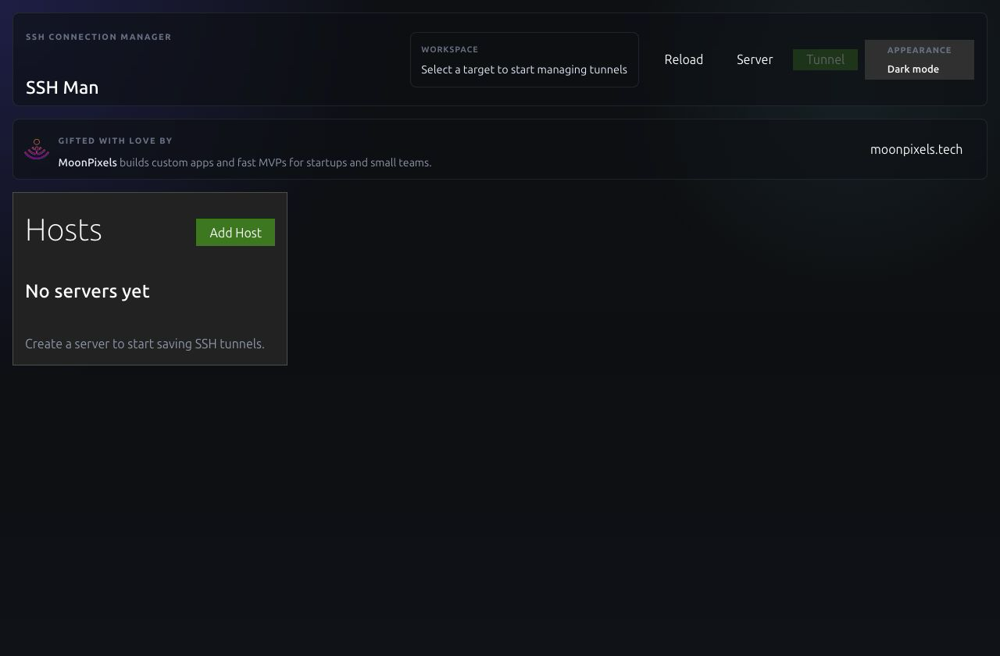

- Strength: the empty state names the next step and the add action is visible.
- UX risks: most of the 1280 x 840 window is unused; three competing header areas appear before the task; `Server`, `Host`, `target`, and `workspace` describe the same object.
- Accessibility risk: the green primary action has weak contrast in dark mode, and its state relies heavily on color.

### Step 2 — Create server — poor

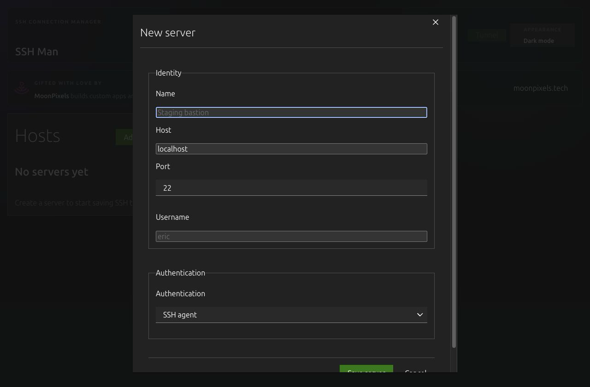

- Strength: native inputs have clear visible labels and useful defaults.
- UX risks: the form is taller than the window and hides its save action; repeated fieldsets add space without helping decision-making; there is no visible pending state.
- Accessibility risks: the dialog does not trap or restore focus, errors are not associated with their inputs, and the close target is smaller than a comfortable touch target.

### Step 3 — Select server — fair

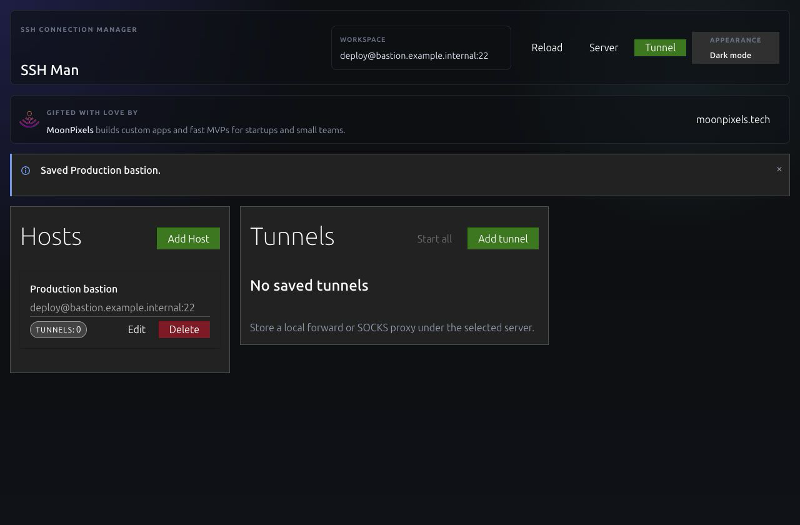

- Strength: the selected server and its tunnel count are readable.
- UX risks: add actions are duplicated in the header and panels; delete is as prominent as routine actions; the persistent promotion occupies more space than runtime state.
- Accessibility risk: dense controls and muted secondary text are difficult to scan at reduced size.

### Step 4 — Create tunnel — poor

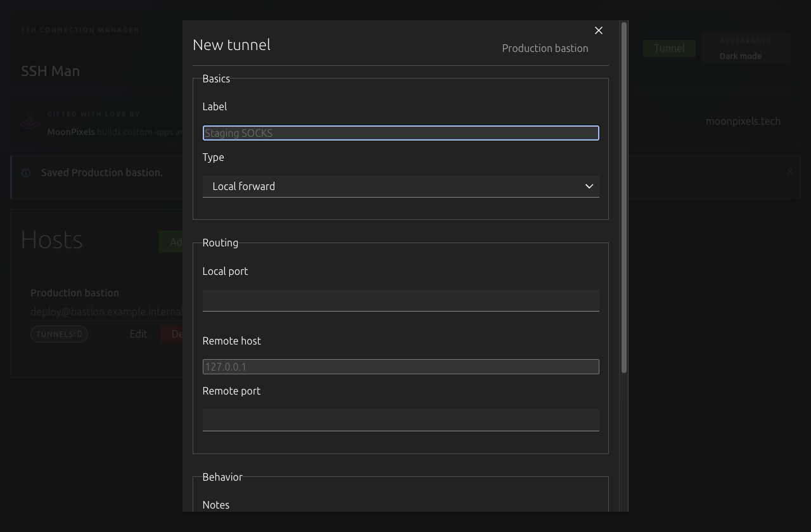

- Strength: local-forward and SOCKS concepts are separated and the fields change with tunnel type.
- UX risks: the save action is not visible at the initial viewport; the dialog has multiple nested scroll contexts; routing fields are vertically wasteful for a compact utility.
- Accessibility risks: users must discover that the dialog itself scrolls, focus is not contained, and errors are not announced or linked to controls.

### Step 5 — Manage a saved tunnel — fair

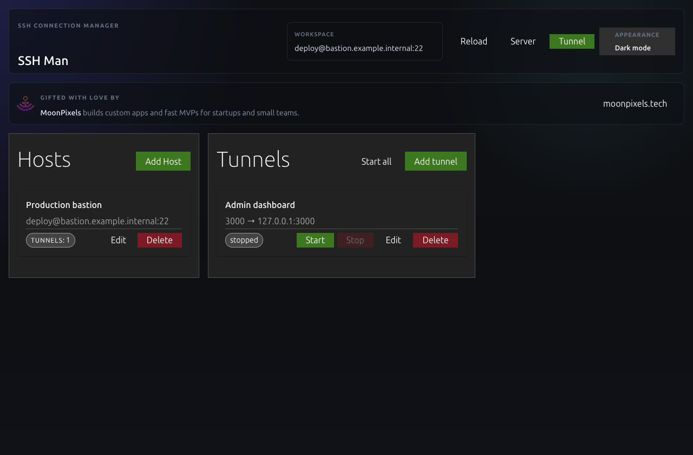

- Strength: endpoint and status text accompany color, and start/stop actions are explicit.
- UX risks: every row shows Start, Stop, Edit, and Delete at once; stopped and failed tunnel details/history disappear from the right pane; destructive actions have no confirmation or undo.
- Accessibility risk: disabled and muted states have low contrast, while dense row actions leave small click targets.

### Step 6 — Use the compact window — critical

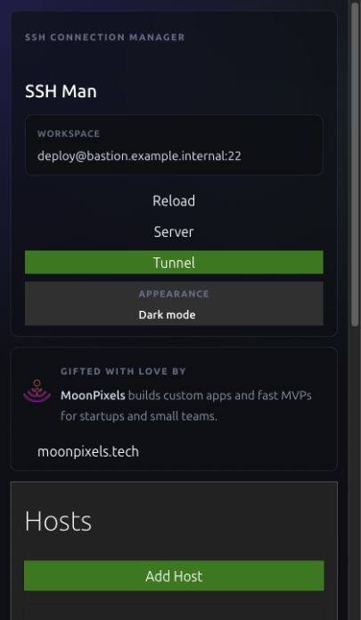

- UX risks: the header and promotion consume nearly the entire first viewport, so the selected server, tunnel, status, and controls require document scrolling; this is a stacked desktop page, not an app navigation model.
- Accessibility risks: important controls have no persistent location, viewport reflow creates an unexpectedly long reading order, and the narrow scrollbar competes with edge controls.

### Step 7 — Edit from the compact window — critical

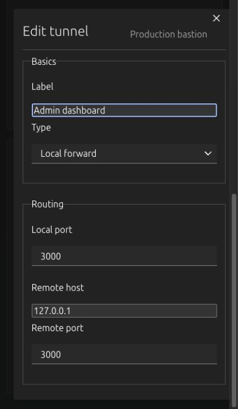

- UX risks: the sticky context and save action are missing, the form requires a long internal scroll, and the user cannot see both the editing context and completion action.
- Accessibility risks: nested scrolling, no focus trap, small close affordance, and hidden validation/action regions make keyboard and zoom use fragile.

## Highest-impact changes

1. Replace the responsive dashboard with Servers, Active, and Settings app screens plus drill-down server and tunnel details.
2. Keep the document fixed to the window and give each screen or form exactly one labeled scroll region.
3. Put save/cancel and start/stop actions in persistent action areas; move Edit/Delete into secondary menus and confirm deletion.
4. Keep runtime detail and history available for stopped and failed tunnels, not only active sessions.
5. Show pending and stale-runtime states, and give repeated errors unique announcements.
6. Move MoonPixels attribution and diagnostics into Settings.
7. Bundle all styling locally and use 44 px minimum touch targets with visible focus and input-associated errors.

## React rewrite outcome

The rewrite implements the compact app model from the sweep. The document stays fixed at 420 x 720, every screen owns at most one scroll region, and the persistent header, bottom navigation, or form/action footer holds the controls users need to orient themselves and finish the current task.

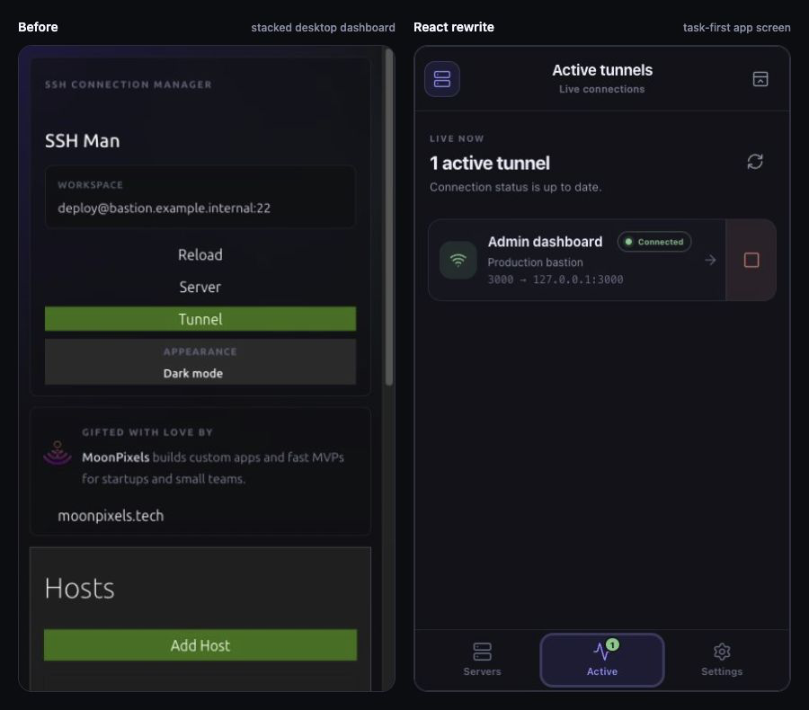

The same-viewport comparison makes the largest change visible: the original first viewport is chrome, attribution, and setup panels, while the rewrite puts the live tunnel and its direct control in a stable app screen.

### Step 1 — Empty workspace — good

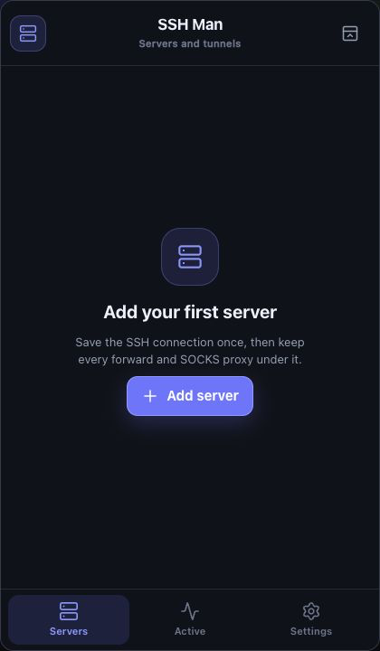

- The first action is centered in the available task space instead of competing with dashboard chrome and promotion.
- Servers, active connections, and settings now have stable bottom-navigation positions.

### Step 2 — Create server — good

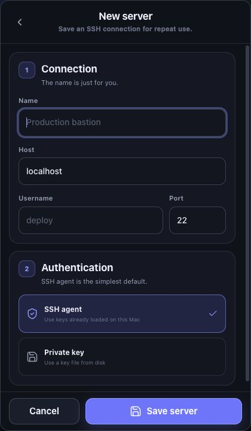

- The connection and authentication decisions are grouped into two compact sections.
- Cancel and Save remain visible while the form content scrolls; validation is associated with the affected input and focus moves to the first error.

### Step 3 — Select server — good

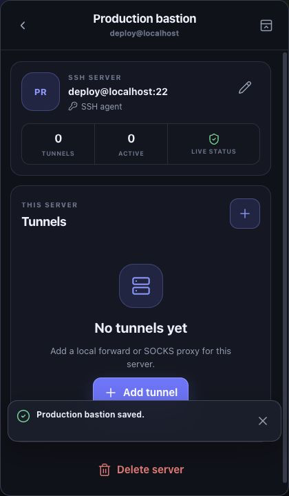

- Server identity, authentication, tunnel count, active count, and runtime freshness share one summary.
- Routine tunnel work is primary; Edit is compact and Delete is separated at the end of the screen.

### Step 4 — Create or edit tunnel — good

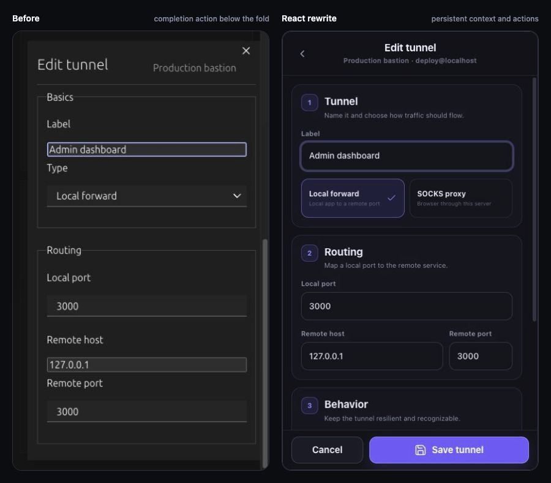

- Tunnel type, routing, and behavior form a short three-step hierarchy with compact port layouts.
- The route context stays in the header and the action footer never scrolls away.

### Step 5 — Manage a stopped tunnel — good

- Status, endpoint, settings, and connection history remain visible when the tunnel is stopped or failed.
- The valid next action is persistent at the bottom; deletion is secondary and requires confirmation.
- Key-unlock prompts can be dismissed and reopened from the tunnel action instead of stranding the connection in an attention state.

### Step 6 — Control active tunnels — good

- Active connections have a dedicated screen, direct stop controls, an active-count badge, and an explicit stale/refresh state.
- A connected tunnel retains its bound port and troubleshooting history on the detail screen.
- Server-level start only targets inactive tunnels, leaves connected tunnels untouched, and refreshes live state after a partial failure.

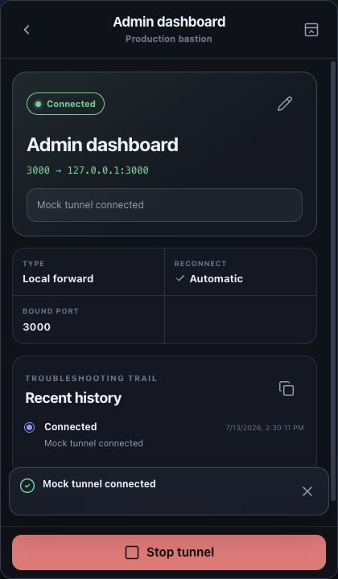

The SOCKS branch was also exercised end to end: automatic port allocation updates the endpoint, installed browsers populate after connection, and launch remains immediately reachable above the persistent Stop action.

### Step 7 — Adjust and exit the menu-bar app — good

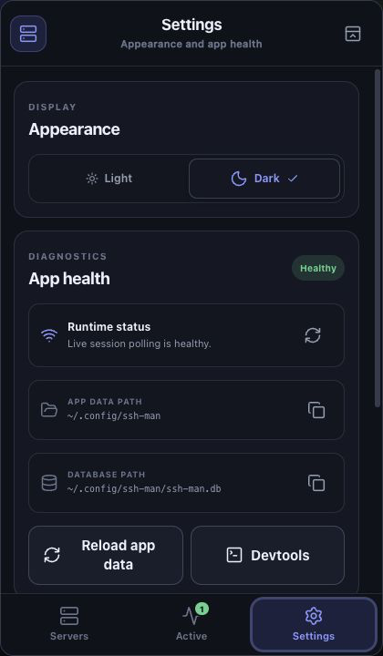

- Theme, runtime health, paths, developer tools, attribution, and the explicit Quit action moved out of the tunnel workflow.
- Hiding the popup keeps tunnels running; Quit is labeled as the action that stops them safely.

Implementation checks found no body/document scrolling at 420 x 720 and no visible interactive target below 44 x 44 px in the exercised screens. Stale status replaces bulk controls with an explicit refresh action, and per-tunnel lifecycle operations are serialized to prevent overlapping starts. The frontend no longer depends on the external Vanilla CSS CDN.

## macOS menu-bar verification

The final universal app candidate starts hidden with no normal Dock presence, opens the exact 420 x 720 React popup on a second launch, hides without stopping sessions, reopens cleanly, and exits through the Wails shutdown lifecycle from Settings. The same candidate passed arm64 and x86_64 packaging, `LSUIElement` readback, and strict deep code-sign verification.

Process-level smoke testing exposed an AppKit lifetime crash during repeated second-instance launches. Retaining and releasing the status item and popup window explicitly fixed it; repeated reopen tests then remained stable. Direct automated right-click of the macOS status item was unavailable because that item was not exposed in the automation accessibility tree, so the native Open/Quit context-menu path remains compile- and code-reviewed rather than click-automated.

## Evidence limits

Screenshots support the layout, hierarchy, contrast-risk, target-size, and responsive findings. They do not prove screen-reader output, complete keyboard behavior, color contrast ratios, reduced-motion behavior, or full WCAG conformance; those require implementation-level and assistive-technology verification.
